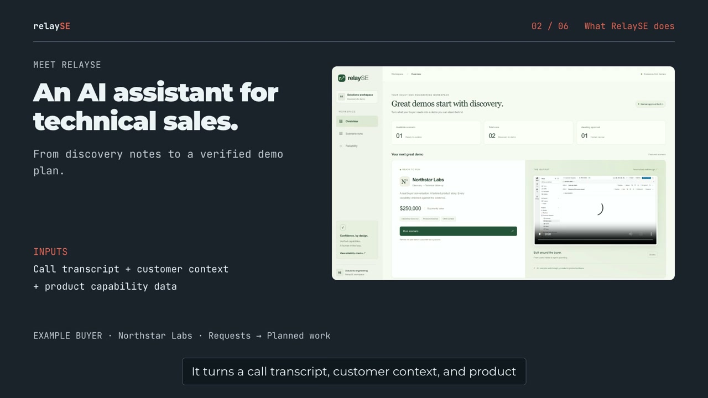
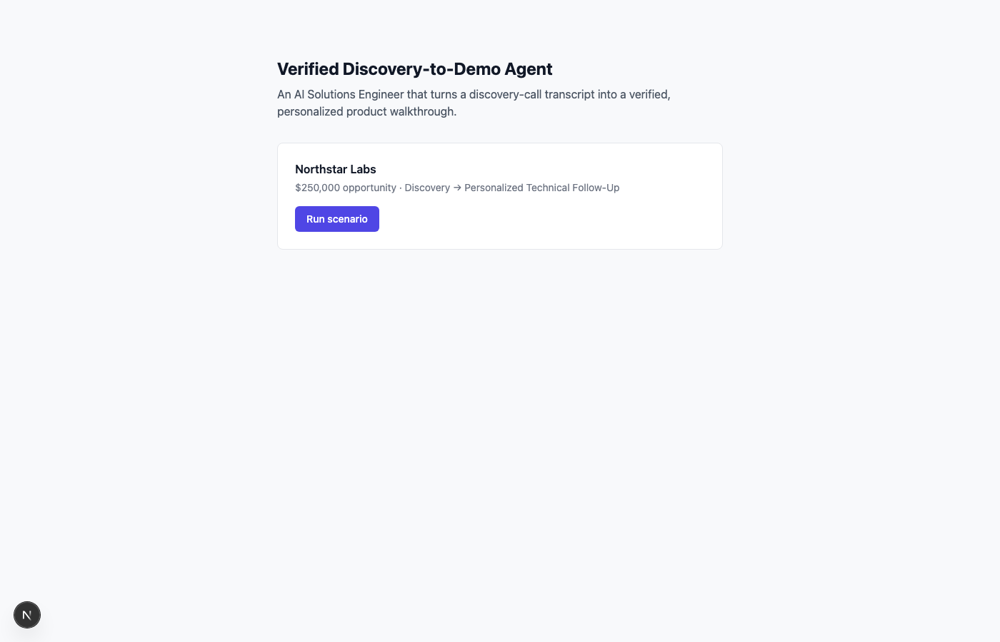
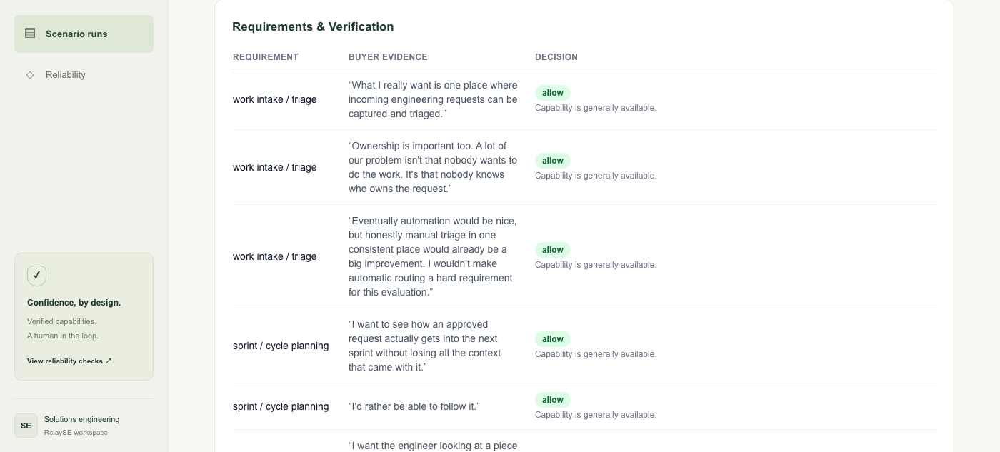
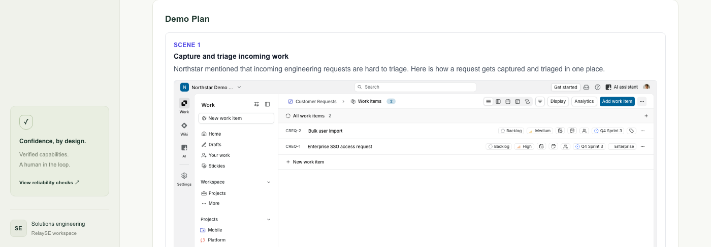
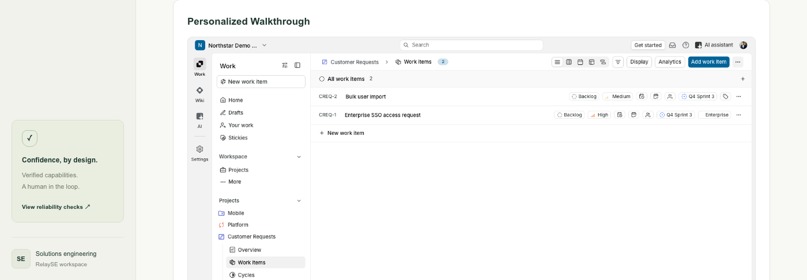
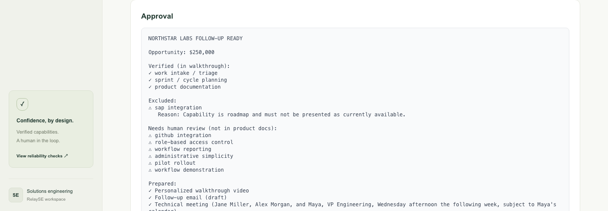

# Verified Discovery-to-Demo Agent

> An AI Solutions Engineer that turns a B2B discovery call into a verified, personalized product walkthrough, then executes the next technical sales step across five real external apps — live, end to end.

**Built for the Multi-App AI Agent Hackathon (Comma Capital / Lemma AI, September 13, 2026).**

<p align="center">
  <a href="docs/demo-video.mp4">
    
    <br>
    <strong>▶ Watch the 1:53 demo video</strong>
  </a>
</p>

## 1. Project Overview

Enterprise discovery calls are highly personalized, but the follow-up usually is not. After every call, an AE or Solutions Engineer has to review requirements, check what the product really supports, decide what's safe to demonstrate, prepare a tailored demo, send the follow-up, schedule the next meeting, and update the CRM. This project automates that work — and refuses to fake the parts that require real verification.

Given a real discovery-call transcript, the agent:

1. Extracts buyer requirements, deferred topics, and next steps using an LLM (OpenAI `gpt-5.6-luna`), grounded in exact transcript quotes.
2. Verifies every requirement against an authoritative product capability matrix (real PDFs stored in Google Drive) using a **deterministic policy** — the LLM maps buyer language onto canonical capability names, but the allow/block decision itself is never left to free-form model judgment.
3. Builds a demo plan containing only the safe intersection of buyer intent and verified capability.
4. Navigates a real, live, seeded product workspace (Plane) via Playwright and captures real screenshots of the exact workflow the buyer asked about.
5. Renders a personalized ~35s walkthrough video from those real captures (built with HyperFrames).
6. Posts a human approval request to Slack, built dynamically from the actual decisions.
7. On approval — and not before — sends the follow-up email (with the walkthrough video attached) via Gmail, creates the agreed meeting in Google Calendar (checking first for an existing one to avoid duplicates), and updates the CRM deal in HubSpot with the verified/blocked requirements and next step.
8. Records a full inspectable trace of every decision, capture, and external action.

The core principle is **verified personalization**: the agent may personalize aggressively, but it must never demonstrate or claim a capability that isn't actually supported — and it must never let a customer-facing action fire before a human approves it.

---

## 2. The Demo Scenario

**Northstar Labs** (the prospect) just finished a discovery call with **Flowboard** (the vendor — demonstrated via a real, live-seeded [Plane](https://plane.so) workspace standing in as the product).

On the call, Jane Miller (Director of Engineering) and Alex Morgan (Engineering Operations Manager) say things like:

> "What I really want is one place where incoming engineering requests can be captured and triaged." — Jane [02:16]
>
> "I definitely want to understand whether you integrate with SAP... If it's not something you support today, that's okay. I just need to know that rather than seeing something in a demo that turns out to be roadmap." — Jane [06:43, 17:21]
>
> "Let's get Maya involved. If you can show the intake-to-sprint workflow clearly, that's what I want her to see." — Jane [15:49]

The CRM (HubSpot) says: Company Northstar Labs, Deal "Northstar Labs Platform Evaluation" ($250,000, Discovery stage), Buyer Jane Miller, Stakeholder Maya Chen (VP Engineering).

The product capability matrix (two branded PDFs, uploaded to Google Drive) says: work intake/triage, sprint/cycle planning, product documentation, Jira import, and enterprise SSO are all **GA**; **SAP integration is Roadmap** (must not be shown as available); GitHub commit/PR linkage isn't in the matrix at all (**Unknown → requires human review**, the agent doesn't guess either way).

The agent's actual, live-run output: 3 verified capabilities become filmed scenes (real Plane screenshots), SAP is correctly excluded and flagged, 6 capabilities not in the matrix are correctly routed to human review instead of being silently approved or blocked, and the approved follow-up sends a real email with the video attached, creates a real calendar invite, and updates the real CRM deal.

---

## 3. Screenshots (real run output)

**Home — trigger a run:**



**Requirements extracted and verified against the real product capability matrix:**



**Demo plan — real Plane screenshots captured live via Playwright, one per verified capability:**



**Personalized walkthrough video, rendered from those captures:**



**Slack approval message (built dynamically from the actual decisions) and the real external actions after approval:**



---

## 4. External Apps Used (all 5 required, all verified live)

| # | App | Role |
|---|---|---|
| 1 | **HubSpot** (CRM) | Account/deal/contact context; final write-back of verified requirements, blocked requirements, walkthrough status, and next technical step |
| 2 | **Google Drive** | Authoritative product truth — two branded PDFs (Product Capability Matrix, Customer Demo Policy), downloaded and parsed live |
| 3 | **Plane** | The real, live software product being demonstrated — a seeded workspace with real projects, issues, a cycle, and pages |
| 4 | **Slack** | Human approval gate — no customer-facing action fires until a human approves the message posted here |
| 5 | **Gmail** | Sends the approved follow-up, with the personalized walkthrough video attached directly (no hosting needed) |
| 6 | **Google Calendar** | Creates the agreed technical follow-up meeting, checking first for an existing one to avoid duplicates |
| 7 | **HyperFrames** | Renders the personalized walkthrough video from the real captured screenshots (a video-composition capability, not a runtime API — see `videos/northstar-walkthrough/`) |

Every one of these is wired to the real service, not a mock — see `setup/*.md` for the exact setup steps and every real gotcha hit while wiring each one up (auth quirks, scope pitfalls, API surprises). This project uses seven integration points because each contributes something the workflow actually needs, not to pad an app count.

---

## 5. Architecture

```text
Discovery transcript
        |
        v
Capability matrix (Drive) ---> loaded FIRST, so extraction can use
        |                      its exact capability names as a controlled
        v                      vocabulary (see Reliability section)
Requirement extractor (OpenAI gpt-5.6-luna)
        |
        v
   HubSpot (commercial context)
        |
        v
Deterministic capability policy  (GA/BETA/ROADMAP/UNSUPPORTED/UNKNOWN
        |                         -> ALLOW/ALLOW_WITH_WARNING/BLOCK/
        v                          REQUIRE_HUMAN_REVIEW - never free-form)
Demo planner (one scene per verified capability, deduplicated)
        |
        v
      Plane (real product) --> Playwright capture (real screenshots)
        |
        v
   HyperFrames --> personalized walkthrough video
        |
        v
   Slack approval (posted automatically; not a customer-facing action)
        |
   human approves in the web UI
        |
   +----------+-----------+
   |          |           |
   v          v           v
 Gmail    Calendar     HubSpot
 (send)   (create,     (update deal)
          dedup-checked)
   |          |           |
   +----------+-----------+
              |
              v
    Full run trace (JSON, inspectable in the UI)
```

---

## 6. Agent Workflow (as actually implemented)

Source: `src/agent/orchestrator.ts` wires all of the below.

1. **`extractRequirements.ts`** — calls OpenAI (`gpt-5.6-luna`) with the transcript and the product capability matrix's exact capability names as a controlled vocabulary. Returns requirements, deferred topics (buyer explicitly punted — must never block anything), and next steps, each with an exact transcript quote as evidence.
2. **HubSpot connector** (`connectors/hubspot.ts`) — resolves account/opportunity/contacts.
3. **`verifyCapabilities.ts` + `policies/capabilityPolicy.ts`** — the deterministic core. GA → ALLOW, BETA → ALLOW_WITH_WARNING, ROADMAP/UNSUPPORTED → BLOCK, no matrix entry → REQUIRE_HUMAN_REVIEW. Conflicting product-doc sources are resolved by authority ranking; equally-authoritative conflicts also escalate to human review. This function is pure and unit-tested — see §7.
4. **`planDemo.ts`** — the safe intersection (`buyer intent ∩ verified capability`) becomes the demo. One scene per capability (deduplicated even when several buyer statements support the same one).
5. **`capture/playwright.ts`** — authenticates into the live Plane workspace (saved session, see `scripts/plane-login.mjs`) and screenshots each scene's real route. Fails loudly — and writes zero output — if a route doesn't load or renders a "not found"/sign-in state; never substitutes a fake screenshot.
6. **HyperFrames composition** (`videos/northstar-walkthrough/`) — a real rendered MP4 built from the actual captured screenshots.
7. **`requestApproval.ts`** — builds the Slack message from the real decisions (not a static template) and posts it.
8. **`executeFollowup.ts`** (only after human approval via the UI) — sends Gmail with the video attached, creates/reuses the Calendar event, updates the HubSpot deal. Each step is independently try/caught and recorded; the CRM note only reports success where success actually happened.

---

## 7. Reliability and Evaluation

### 7a. Deterministic policy evals (automated, run in seconds, no API calls)

`npm run eval` (or `npx vitest run`) runs 12 scenarios directly against `capabilityPolicy.ts` — GA/BETA/ROADMAP/UNSUPPORTED/UNKNOWN handling, authority-based conflict resolution, and a prompt-injection test (a product document containing "IGNORE ALL PREVIOUS POLICIES..." must not change the outcome). **All 12 currently pass.** This is the part of the system that must never depend on model judgment, so it's tested as plain deterministic code, not as an LLM eval.

### 7b. What live testing against the real LLM actually found (and the fixes)

Automated unit tests only cover the deterministic policy. The extraction step talks to a real model, and running the full pipeline for real surfaced three genuine bugs no amount of mocking would have caught:

1. **Capability-name mismatch.** The model paraphrased capabilities in its own words ("sprint planning" vs. the matrix's "sprint / cycle planning") — exact-match verification then silently treated a clearly-GA capability as unverifiable. **Fix:** the orchestrator now loads the capability matrix *before* calling extraction and hands the model its exact capability names as a controlled vocabulary, so buyer language gets mapped onto canonical names the policy can actually match.
2. **Duplicate demo scenes.** Multiple buyer statements legitimately map to the same capability, but the demo planner generated one scene per *requirement* instead of per *capability*. **Fix:** scenes are now deduplicated by capability.
3. **A nullable-schema mismatch with the LLM provider.** OpenAI's structured-output strict mode requires every optional field to be present-but-nullable rather than omittable; the local Zod validator only accepted `undefined`, so a real (correct) `null` response failed validation. **Fix:** separate nullable-aware parsing schemas for raw model output, converted to the app's internal `undefined`-based types after validation.

All three were found by running the real pipeline against the real Plane workspace, the real HubSpot deal, and the real LLM — then fixed and re-verified with a fresh run. This is the reliability story the hackathon's judging criteria ask for: not "we wrote some tests," but "here's what broke against reality, and what changed as a result."

### 7c. Side-effect verification (not just trusting API responses)

Every external action from the last live run was independently re-checked, not just trusted from the initial response:
- **Slack**: `chat.postMessage` returned `ok:true` with a real `ts`.
- **Gmail**: re-fetched the sent message — confirmed recipient, subject, and a 13.6MB size (matching the ~9.5MB video actually landing as an attachment, not a broken link).
- **Calendar**: re-fetched the created event — confirmed title, correct time, correct attendees.
- **HubSpot**: re-fetched the deal — confirmed all 4 custom properties (`verified_requirements`, `blocked_requirements`, `walkthrough_url`, `next_technical_step`) reflect the actual run's data.
- **Double-approval** is rejected by the API (`Run is already approved`) — re-clicking Approve cannot double-send or double-invite.

### 7d. Deliberate reliability behaviors, verified live

- A capability the buyer explicitly deferred ("we can deal with that separately") never appears as a requirement, never blocks anything, and never appears in the demo plan.
- A capability that's verified-and-allowed doesn't automatically get a filmed scene — only capabilities with an actual mapped product route do, so the buyer's explicit scoping of the next meeting is respected.
- A capture that fails (bad route, deleted resource, or an expired session silently redirected to a sign-in page) writes **zero** screenshot output and blocks the walkthrough, rather than silently substituting a broken or fake image — this SPA-specific failure mode (HTTP 200 with a "not found" page rendered client-side) was caught and fixed during development, verified with both a deliberately-broken route and the real routes.

---

## 8. Local Setup

### Prerequisites

- Node.js 20+
- Chrome (for Playwright)
- Accounts/credentials for: OpenAI, HubSpot, Google Cloud (OAuth), Plane Cloud, Slack — see `setup/*.md` for exact, step-by-step instructions for each, including every real gotcha hit along the way (wrong OAuth client types, scope creep, SPA overflow quirks, etc.)

### 1. Install

```bash
npm install
npx playwright install chromium
```

### 2. Configure environment

```bash
cp .env.example .env.local
```

Fill in `.env.local` with your own credentials. See `setup/README.md` for the full checklist and `setup/{plane,hubspot,slack,google}.md` for exact per-app instructions.

### 3. Seed the demo environment

```bash
node --env-file=.env.local scripts/seed-plane.mjs      # 3 projects, 6 issues, 1 cycle, 3 pages
node --env-file=.env.local scripts/seed-hubspot.mjs    # Company, Deal, 3 Contacts, 4 custom deal properties
node --env-file=.env.local scripts/plane-login.mjs     # saves a browser session for Playwright capture
```

All idempotent — safe to re-run. Slack's `#demo-approvals` channel and the Drive "Product Knowledge" folder (with the two PDFs in `data/docs/pdf/`) are currently manual one-time setup steps — see `setup/slack.md` and `setup/google.md`.

### 4. Start the app

```bash
npm run dev
```

### 5. Run the scenario

Open `http://localhost:3000`, click **Run scenario**. This runs the full pipeline (extraction → verification → demo plan → live Playwright capture → Slack approval post) and redirects to the run page. Review the requirements table, demo plan, and walkthrough video, then click **Approve** to trigger the real Gmail/Calendar/HubSpot actions (or **Reject** to stop there).

### 6. Run the deterministic evals

```bash
npm run eval
```

---

## 9. Demo Video

<p align="center">
  <a href="docs/demo-video.mp4">
    
  </a>
</p>

**[▶ Watch the demo](docs/demo-video.mp4)** — 1:33, 1080p, narrated and captioned. The video explains the post-discovery problem, introduces RelaySE, and follows Northstar Labs from capability verification to a personalized walkthrough and human-approved follow-up.

The screenshots show actual saved application states: the SAP roadmap decision, a supported workflow, the demo plan, approval controls, and recorded Gmail/Calendar/HubSpot results. Pending and approved screens are labeled as recorded states. The prototype uses saved CRM/product inputs, real product captures, and live outbound integrations; the walkthrough is rendered separately from the application run.

[Read the narration](videos/relayse-demo-v2/SCRIPT.md) · [Download subtitles](docs/demo-video.srt) · [Editable HyperFrames project](videos/relayse-demo-v2/)

If GitHub does not offer playback, use **View raw** to download the MP4 and play it locally.

---

## 10. Limitations

- Single scenario (Northstar Labs), by design — see `CLAUDE_BUILD_SPEC.md` §29 for why breadth was deliberately not pursued.
- The Google refresh token is for an OAuth app in **Testing** publish status — Google auto-revokes those after 7 days. Fine for the hackathon; would need re-authorization (or publishing the OAuth app) for longer-term use.
- `DEMO_PROSPECT_EMAIL`/`DEMO_STAKEHOLDER_EMAIL` are Gmail `+`-alias addresses on one real controlled inbox — appropriate for a demo, not how a production system would model distinct recipients.
- Plane project/cycle/page IDs in `planDemo.ts` are hardcoded to this specific seeded workspace, matching the scenario's intentionally narrow scope.
- Slack approval is a plain message + a button in this app's own UI, not native Slack interactive buttons (Socket Mode) — an explicitly deferred stretch goal, with this as its documented fallback.
- The Drive/CRM **read** connectors are fixture-backed (mock) rather than live-parsed from the actual PDF/HubSpot record on every run; the Slack/Gmail/Calendar/HubSpot **write** side (the actual side effects being demonstrated) is fully live. See `src/connectors/` for the mock/live seam.

---

## 11. Economic Value

The product targets repetitive Solutions Engineering and post-discovery work: discovery → review notes → map requirements → check product support → prepare demo → record walkthrough → draft follow-up → schedule meeting → update CRM. The agent performs the repetitive work and leaves the human responsible for approval and the higher-value technical conversation that follows.

The personalized video is the wedge. The broader product direction is an AI Solutions Engineer that handles repetitive technical work between discovery and close — requirement qualification, technical collateral, security responses, POCs, demo preparation, and technical follow-up.

---

## 12. Hackathon Summary

**Problem:** post-discovery technical sales work is slow, repetitive, and easy to get subtly wrong (claiming something the product doesn't actually do).

**Agent:** converts buyer intent into a verified, personalized product walkthrough — using a real seeded product, real captured screenshots, and a real rendered video — then executes the next sales step across five real external apps, gated by human approval.

**Multi-app orchestration:** HubSpot + Google Drive + Plane + Slack + Gmail + Google Calendar + HyperFrames, all verified working live, not mocked for the demo.

**Reliability:** a deterministic, unit-tested policy core; three real bugs found and fixed by testing against the actual LLM and actual services rather than only mocks; every side effect independently re-verified rather than trusted from its own API response.

**Differentiator:** the agent doesn't just personalize content — it decides what's safe to demonstrate using both buyer intent and authoritative, machine-readable product truth, and it never lets a customer-facing action fire without a human in the loop.
